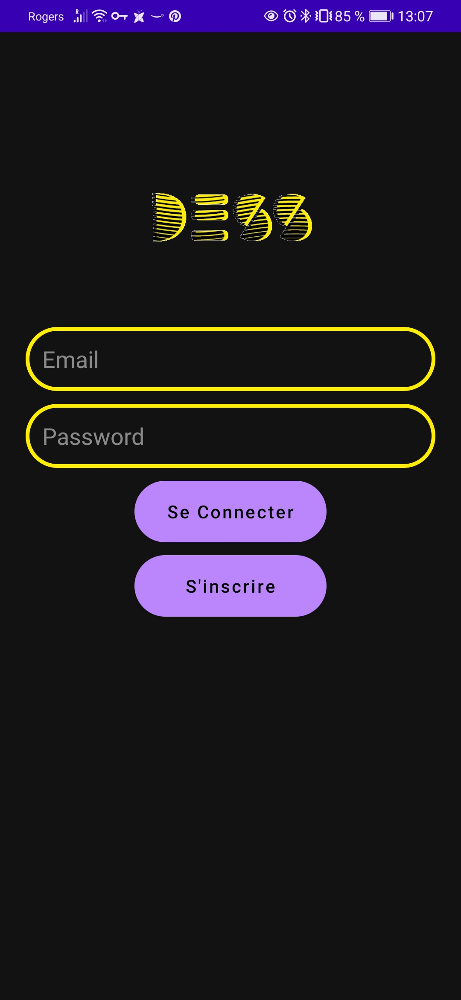
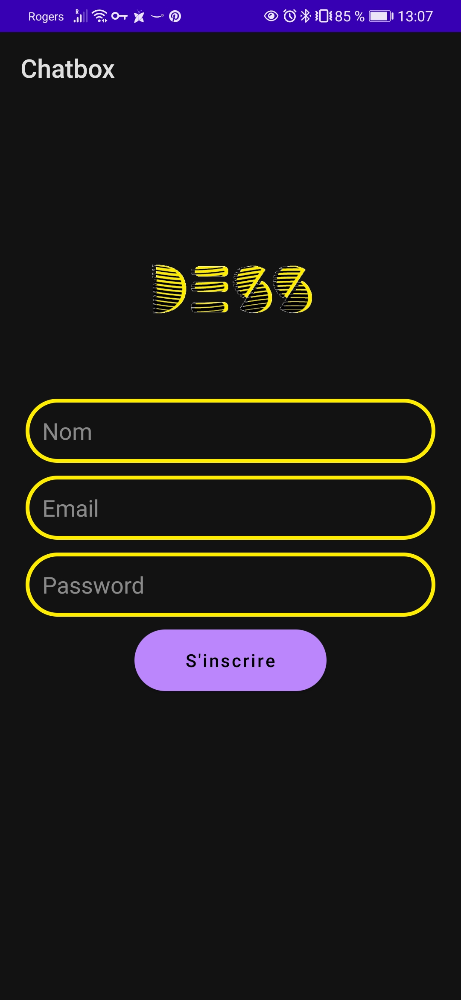
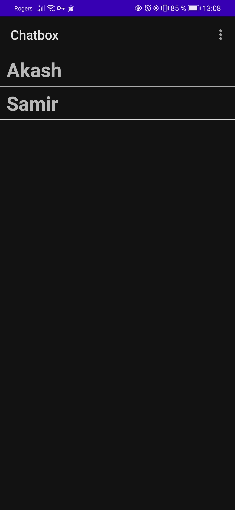
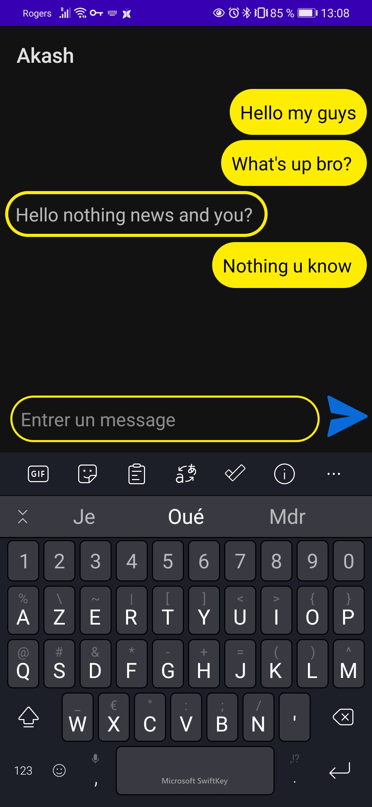

# Chatbox

This project is an Android chatbox

## Stack

1. Firebase
2. MVVM

## Guide
So as to running the app, you will need to download the project and loading on Android Studio. Launch the project in an emulator or in an android phone.

### Registration
1. To be registred, click on "S'inscrire" button

2. Fill the list and validated. You will be redirected on the Home Page

### Connection
1. Enter your email and password and click on "Se connecter" button 

2. If the identifiers was correct, you will be redirected on the Home page

### Chat
1. To chat with someone, click on his name

2. You will be on the historic of your conversion. Here you can write, send and receive messages

